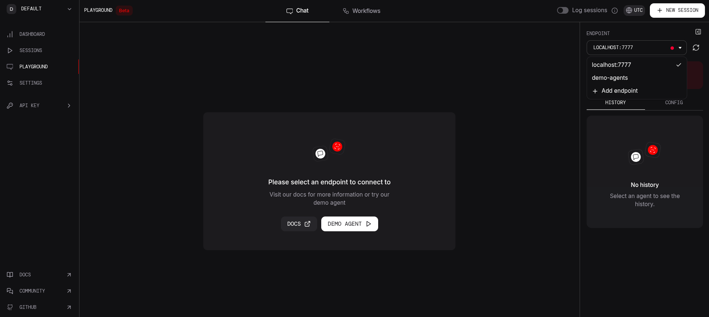

# Financial AI Agent

## Description

Create you own financial AI agent using open source LLM models

## How to use

1. Create a virtual environment, activate it and install all the required libraries (I used miniconda)

```bash
conda create -p venv python=3.12 # creates a virtual environment called venv in the current directory

conda activate ./venv # activate the virtual environment

pip install -r requirements.txt # install all the libraries in the requirements.txt file
```

2. Create an account or login to groq (not Grok) and phidata and generate API keys.

3. Save the API keys in a `.env` file. Make sure the `.env` file is in the root folder of this project

```bash
PHIDATA_API_KEY="your-phidata-api-key"
GROQ_API_KEY="your-groq-api-key"
```

### Local Financial Agent

- You can try different models from groq website and see which suits you the best. I've used `llama3-groq-8b-8192-tool-use-preview`
- You can enter your prompt and accordingly change the last line of the file `financial_agent.py`
- Run the file `financial_agent.py`

```bash
python3 financial_agent.py
```

### Financial Agent Chatbot

- Run the file `playground.py`. This creates a playground for your financial agent and hosts it on `http://localhost:7777` by default
- Go to [phidata playground section](https://www.phidata.app/playground/chat) and create a endpoint
  
- After connecting the endpoint, you can chat with your financial agent, just like ChatGPT
